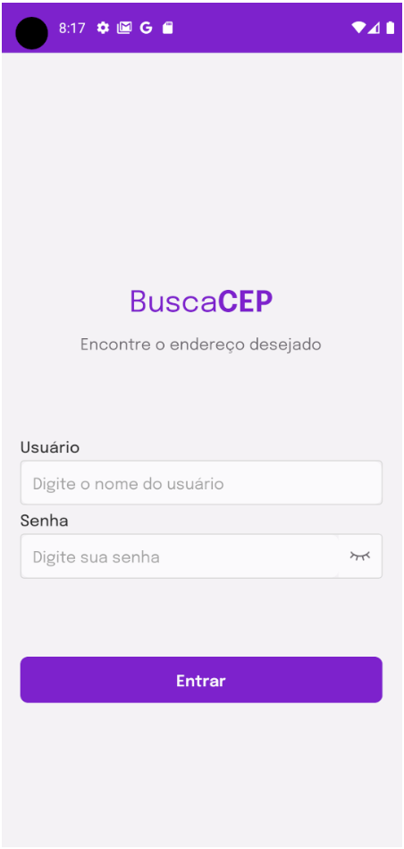
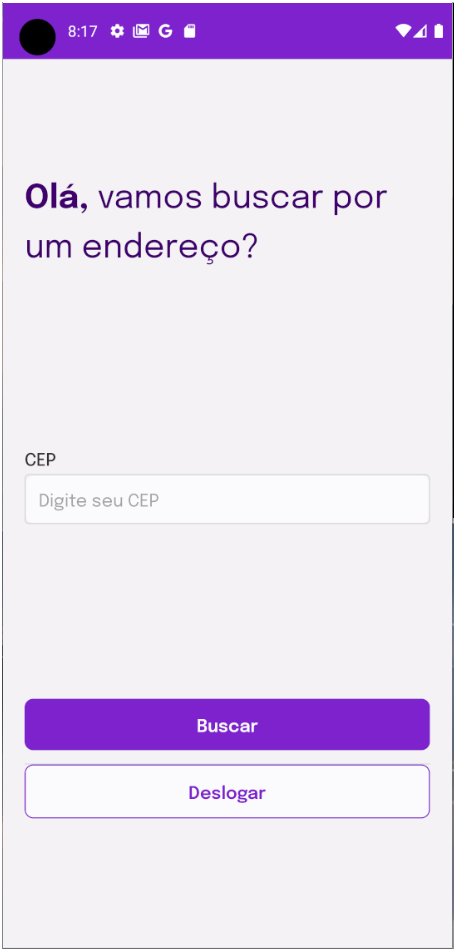
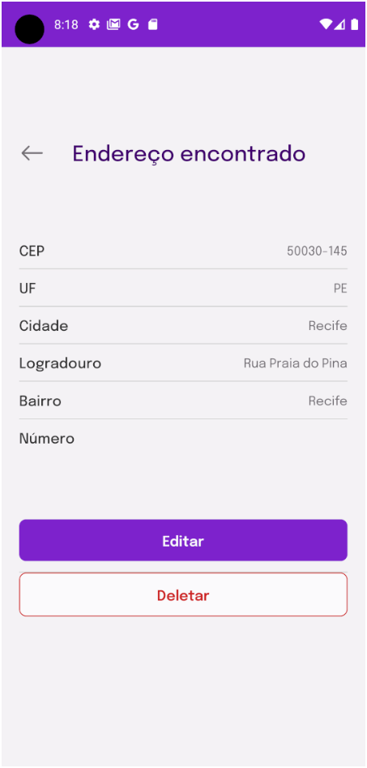
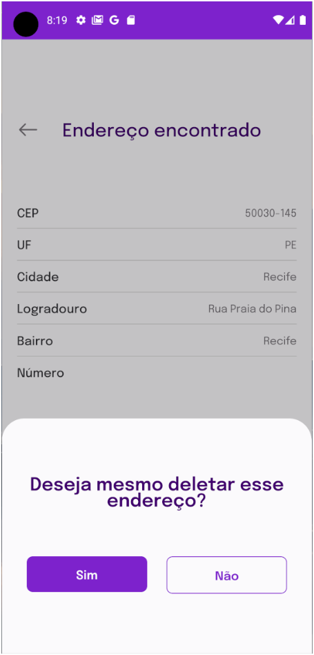
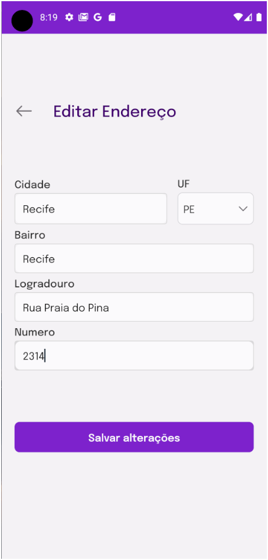

<h1 align="center">BuscaCEP</h1>
<h1 align="center">
  <a href="<https://reactnative.dev/>">🔗 React Native</a>
</h1>
<p align="center">Um aplicativo de consulta de api - <a href="<https://github.com/marcosmacedoo/teste-tecnico-fido-desenvolvedor-mobile-jr>">🔗 Desenvolvedor Mobile Jr</a></p>

## Introdução

O App BuscaCEP foi desenvolvimento com React Native CLI. Ao entrar com suas credenciais de conta, fornecidas pelo <a href="<https://64d4f66fb592423e4694f420.mockapi.io/api/v1/>">MockAPI</a>, o usuário pode inserir um CEP que é consultado na API da <a href="<https://viacep.com.br/>">ViaCEP</a>. Os dados do endereço recebido é inserido nos dados do cliente, onde o usuário pode consultar e editar o endereço.

## Principais Recursos

- **Autenticação de Usuário:** Os usuários podem acessar o aplicativo com usando suas contas, utilizando a API do MockAPI.

- **Consulta de CEP:** Através da integração com a API da ViaCEP, os usuários podem inserir um CEP e receber informações atualizadas, que são automaticamente vinculadas aos seus dados de usuário.

- **Edição de Endereço:** Além de consultar os dados, os usuários também têm a capacidade de editar seu endereço.

## Protótipo de Interface

A interface do aplicativo foi projetada com base em um <a href="<https://www.figma.com/file/2823d5LCnlZVepEPD4ugNU/Teste-t%C3%A9cnico-da-Fido-%7C-Desenvolvedor-Mobile-Jr?type=design&node-id=0-1&mode=design&t=nV1ShllOWbSura9k-0>">protótipo</a>.

## Tecnologias Utilizadas

- [React Native](https://reactnative.dev/)
- [API MockAPI](https://www.mockapi.io/)
- [API ViaCEP](https://viacep.com.br/)

## Capturas de Tela

Aqui estão algumas capturas de tela do **BuscaCEP** para dar a você uma prévia visual do aplicativo:

### Tela de Login



> A tela de login permite que os usuários façam login em suas contas.

### Consulta de CEP



> Os usuários podem inserir um CEP para obter informações detalhadas.

### Detalhes do Endereço



> Mostra os dados salvos de endereço.

### Deletar Endereço



> Os usuário podem remover os dados de endereço salvo

### Edição de Dados Pessoais



> Os usuários têm a capacidade de editar suas informações pessoais.

## Pré-requisitos

- Node.js
- npm ou yarn
- Emulador Android\iOS ou Dispositivo Físico para Testes

## Instalação

1. Clone o repositório:

   ```bash
   git clone https://github.com/jhiltonsantos/buscaCep.git
   ```

2. Navegue até o diretório do projeto

3. Instale as dependências:

   ```bash
   npm install || yarn install
   ```

## Como Usar

1. Inicie o servidor de desenvolvimento:

   ```bash
   npx react-native start || yarn start
   ```

2. Execute o aplicativo no emulador ou dispositivo:

   ```bash
   npx react-native run-android || yarn android # Para Android
   npx react-native run-ios || yarn ios     # Para iOS
   ```

## Testes

O **BuscaCEP** inclui alguns testes utilizando o jest. Esses testes também estão sendo executados pelo Github Actions ao realizar push\pull request no repositório.
Para executar os testes, siga estas etapas:

1. Certifique-se de que você tenha todas as dependências instaladas, executando o seguinte comando:

   ```bash
   yarn install
   ```

2. Agora, execute os testes com o comando:
   ```bash
   yarn test
   ```

## Contato

Nome: Hilton Santos

Email: jhilton930@gmail.com

GitHub: jhiltonsantos
